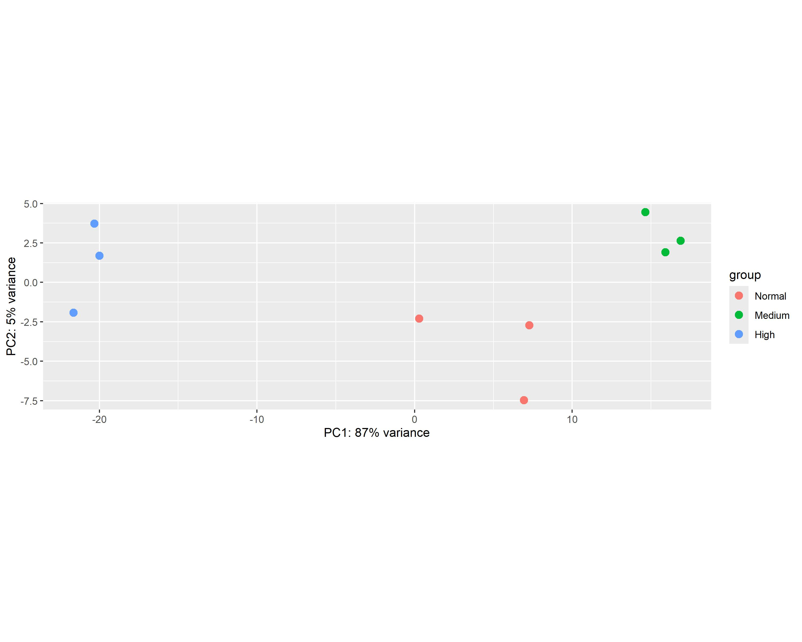
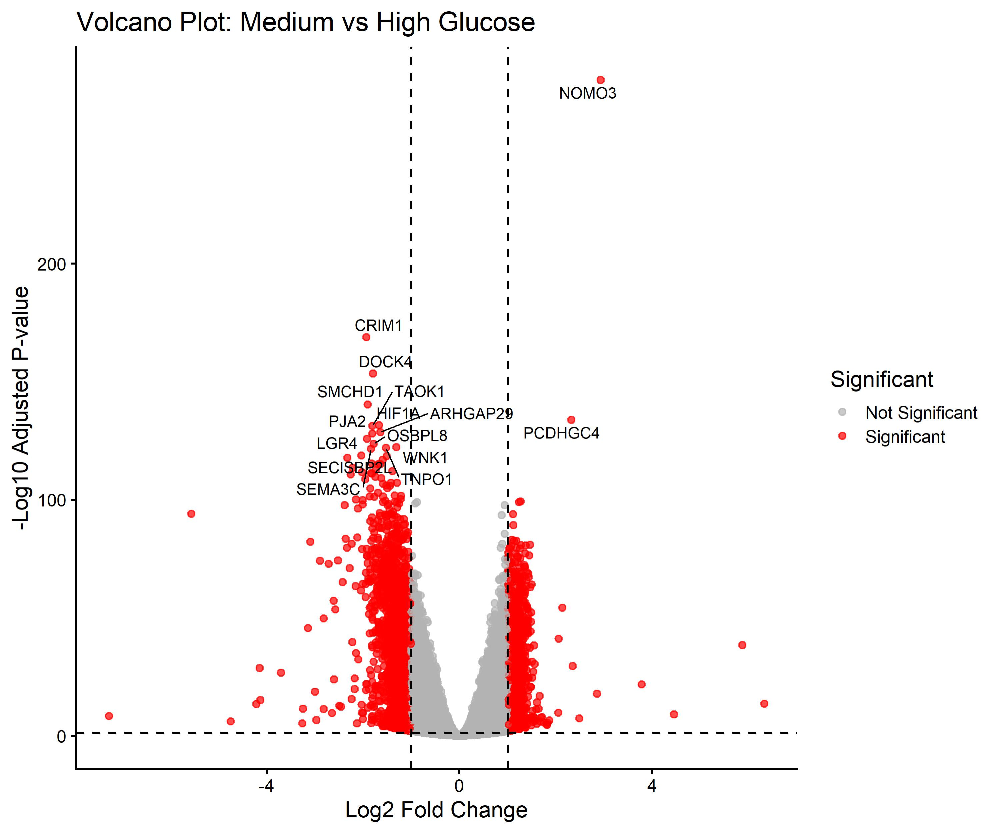
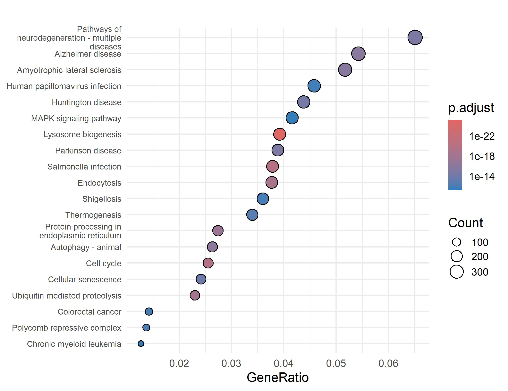
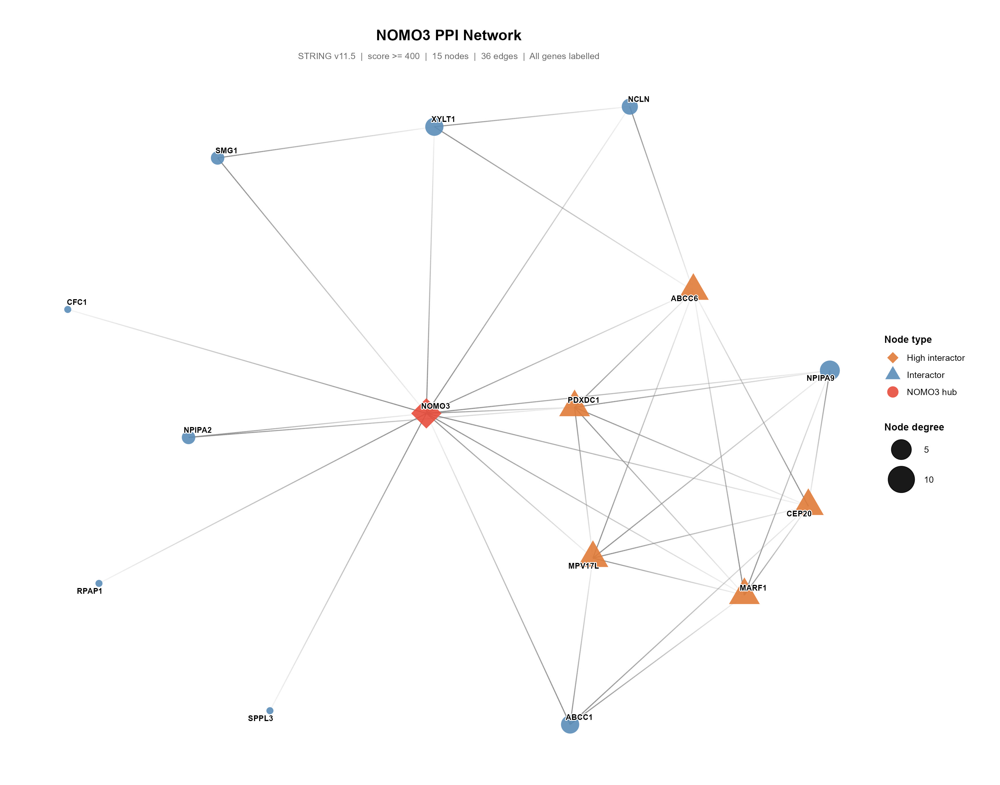

# Transcriptomic Analysis of Glucotoxic Human Podocytes

**Ribosomal, Mitochondrial and ER-Associated Stress Signatures in Glucotoxic Human Podocytes**

> V Sai Pranav¹ & Prashantha C N¹  
> ¹ Department of Biotechnology, School of Applied Sciences, REVA University, Bengaluru, India

---

## Overview

Diabetic kidney disease (DKD) is one of the leading causes of chronic kidney disease worldwide. Podocytes — specialised epithelial cells forming the glomerular filtration barrier — are particularly vulnerable to sustained hyperglycaemia. This project presents a **comprehensive secondary bioinformatics analysis of RNA-seq data** from human podocytes cultured under high- (30 mM), medium- (15 mM) and normal- (5.5 mM) glucose conditions.

Our multi-layered analysis integrates:
- Differential gene expression (DESeq2)
- Pathway enrichment (GO ORA, KEGG ORA, GSEA)
- Protein–protein interaction network analysis (STRINGdb)
- Transcription factor activity inference (decoupleR / DoRothEA)
- External validation using human DKD transcriptomic data

---

## Key Findings

| Finding | Detail |
|---|---|
| **NOMO3** | Most significantly differentially expressed gene (padj < 10⁻²⁵⁰); strongly downregulated under high glucose; novel candidate linking ER stress to glucotoxicity |
| **Ribosomal activation** | Ribosome pathway had the highest KEGG GeneRatio (~76%) — coordinated translational upregulation under high glucose |
| **Mitochondrial remodelling** | Oxidative phosphorylation significantly enriched; MRPL12/MRPL27 as hub genes |
| **TF suppression** | ESR1, HIF1A, FOXO3, SMAD3 strongly suppressed — erosion of podocyte homeostatic programmes |
| **Core gene set** | 728 conserved DEGs shared across both glucose-reduction contrasts |
| **External validation** | RPS15, RPS19, RPL13 ribosomal signatures confirmed in human DKD glomerular tissue (GSE30528) |

---

## Representative Results

### PCA Analysis



**Principal Component Analysis (PCA) demonstrating clear transcriptomic separation between glucose treatment groups. PC1 explains approximately 87% of total variance.**

---

### Differential Expression



**Volcano plot showing significantly differentially expressed genes between Medium and High glucose conditions.**

---

### KEGG Enrichment



**KEGG pathway enrichment analysis highlighting ribosome and oxidative phosphorylation as dominant biological pathways.**

---

### NOMO3 Network



**Protein–protein interaction network centered on NOMO3, the most significantly altered gene identified in the study.**

## Repository Structure

```
glucotoxic-podocyte-transcriptomics/
│
├── R/
│   └── glucotoxic_podocyte_analysis.R   # End-to-end reproducible pipeline
│
├── data/
│   └── csv/
│       ├── DESeq2_M_vs_H_results.csv             # DESeq2 results: Medium vs High
│       ├── DESeq2_N_vs_H_results.csv             # DESeq2 results: Normal vs High
│       ├── DESeq2_Medium_vs_High_shrunken.csv    # LFC-shrunken results (apeglm)
│       ├── DESeq2_Normal_vs_High_shrunken.csv    # LFC-shrunken results (apeglm)
│       ├── Core_Shared_DEGs.csv                  # 728 conserved core DEGs
│       ├── SIGNIFICANT_DEGs_Medium_vs_High.csv   # Significant DEGs (M vs H)
│       ├── SIGNIFICANT_DEGs_Normal_vs_High.csv   # Significant DEGs (N vs H)
│       ├── KEGG_enrichment_results.csv           # KEGG ORA results
│       ├── KEGG_top20.csv                        # Top 20 KEGG pathways
│       ├── GO_BP_top20.csv                       # Top 20 GO:BP terms
│       └── PCA_coordinates.csv                   # PCA sample coordinates
│
├── figures/
│   ├── 01_QC/          # PCA, heatmap, MA plots, dispersion
│   ├── 02_DEG/         # Volcano plots
│   ├── 03_Enrichment/  # KEGG/GO dot plots, networks, GSEA ridge plots
│   ├── 04_Networks/    # STRING PPI networks, NOMO3 network
│   └── 05_TF/          # Transcription factor activity barplot
│
├── paper/
│   └── paper_publication_ready260526.docx   # Manuscript (publication-ready draft)
│
└── README.md
```

---

## Data Availability

| Dataset | Description | Access |
|---|---|---|
| **GSE307956** | Primary RNA-seq — human podocytes (H/M/N glucose) | [GEO Link](https://www.ncbi.nlm.nih.gov/geo/query/acc.cgi?acc=GSE307956) |
| **GSE30528** | Validation — human DKD glomerular microarray | [GEO Link](https://www.ncbi.nlm.nih.gov/geo/query/acc.cgi?acc=GSE30528) |

> Raw count data are publicly available on NCBI GEO. Processed results (DESeq2 outputs, enrichment tables) are provided in `data/csv/`.

---

## Methods Summary

### Tools & Packages (R)

| Step | Tool / Package |
|---|---|
| Normalisation | DESeq2 (median-of-ratios); apeglm LFC shrinkage |
| QC | PCA, sample-distance heatmap, dispersion plot |
| Differential Expression | DESeq2 v1.42 |
| DEG Threshold | padj < 0.05; \|log₂FC\| > 0.5 |
| Functional Enrichment | clusterProfiler v4.10 (ORA + GSEA) |
| Gene Ontology | org.Hs.eg.db, GO:BP |
| KEGG Analysis | enrichKEGG, gseKEGG |
| PPI Network | STRINGdb v12.0 (confidence ≥ 0.400); igraph; Louvain clustering |
| TF Inference | decoupleR v2.17; DoRothEA (A–C regulons); ULM method |
| Visualisation | ggplot2, pheatmap, enrichplot |
| R Version | R 4.3 |

### Analysis Design

```
GSE307956 RNA-seq counts (n=9)
    ↓
Quality Control (PCA, heatmap, dispersion)
    ↓
DESeq2: M vs H + N vs H contrasts
    ↓
Core Gene Set (intersection, n=728)
    ↓
┌───────────────────┬───────────────────┬─────────────────┐
KEGG/GO ORA       GSEA               PPI Network        TF Activity
(clusterProfiler) (gseKEGG)          (STRINGdb+igraph)  (decoupleR)
    ↓                                        ↓
External Validation ← ─ ─ GSE30528 ─ ─ →  NOMO3 subnetwork
```

---

## Figures

| Figure | Description |
|---|---|
| Fig 1A | PCA — PC1 explains ~87% of transcriptomic variance |
| Fig 1B | Sample-distance heatmap — clear 3-group clustering |
| Fig 1C | DESeq2 dispersion plot |
| Fig 2A/2B | Volcano plots — M vs H and N vs H |
| Fig 2C/2D | MA plots |
| Fig 3 | Heatmap of top 20 core DEGs (row-normalised VST) |
| Fig 4 | KEGG ORA dot plot — ribosome pathway top-enriched |
| Fig 4B | GO:BP ORA dot plot |
| Fig 4C | GO:BP enrichment network (cnetplot) |
| Fig 5A/5B | GSEA dot plot + ridge plot |
| Fig 5C | KEGG GSEA enrichment network |
| Fig 6 | NOMO3 boxplot — marked downregulation under high glucose |
| Fig 7A | STRING PPI network of 628 core genes (Louvain clusters) |
| Fig 7B | NOMO3 dedicated PPI network (22 direct interactors) |
| Fig 8 | External validation — RPS15, RPS19, RPL13 in human DKD tissue |
| Fig 9 | TF activity barplot — E2F1/RELA activated; ESR1/HIF1A suppressed |

---

## How to Reproduce

1. **Install R packages:**
   ```r
   install.packages(c("DESeq2", "ggplot2", "pheatmap", "clusterProfiler",
                      "org.Hs.eg.db", "igraph", "STRINGdb", "decoupleR", "apeglm"))
   ```

2. **Download raw data** from GEO (GSE307956) and place counts in `data/csv/`.

3. **Run the analysis:**
   ```r
   source("R/glucotoxic_podocyte_analysis.R")
   ```

---

## Authors

**V Sai Pranav**  
Department of Biotechnology, REVA University, Bengaluru, India

**Prashantha C N** *(Corresponding Author)*  
Department of Biotechnology, REVA University, Bengaluru, India  
📧 prashantha@reva.edu.in

---

## Citation

If you use this code or data, please cite:

> V Sai Pranav & Prashantha C N. *Transcriptomic Analysis Reveals Ribosomal, Mitochondrial and ER-Associated Stress Signatures in Glucotoxic Human Podocytes.* REVA University, 2026.

---
---

## Future Directions

* Experimental validation of NOMO3 function in glucotoxic human podocytes
* Single-cell RNA-seq analysis of diabetic kidney disease progression
* Multi-omics integration combining transcriptomics, proteomics, and metabolomics
* Functional characterization of ER-associated stress pathways identified in this study
* Longitudinal analysis of glucose-induced transcriptomic remodeling
* Development of predictive biomarker panels for early diabetic kidney disease detection

---

## Reproducibility and Computational Environment

| Component       | Version      |
| --------------- | ------------ |
| R               | 4.3          |
| DESeq2          | 1.42         |
| clusterProfiler | 4.10         |
| STRINGdb        | 12.0         |
| decoupleR       | 2.17         |
| DoRothEA        | A–C regulons |
| Genome          | Homo sapiens |
| Data Source     | NCBI GEO     |

---

## Installation

### Install Required Packages

```r
if (!requireNamespace("BiocManager", quietly = TRUE))
    install.packages("BiocManager")

BiocManager::install(c(
  "DESeq2",
  "clusterProfiler",
  "org.Hs.eg.db",
  "STRINGdb",
  "apeglm",
  "decoupleR"
))

install.packages(c(
  "ggplot2",
  "pheatmap",
  "igraph",
  "enrichplot"
))
```

### Run Analysis

```r
source("R/glucotoxic_podocyte_analysis.R")
```

---

## Scientific Contributions

This study provides a comprehensive transcriptomic characterization of glucotoxic stress in human podocytes and identifies coordinated activation of ribosomal and mitochondrial programs alongside suppression of key homeostatic transcriptional regulators.

A major finding is the strong downregulation of **NOMO3**, suggesting a previously underexplored connection between endoplasmic reticulum-associated pathways and diabetic kidney disease pathogenesis. The integration of differential expression analysis, pathway enrichment, protein interaction networks, transcription factor inference, and independent human validation datasets provides a reproducible framework for future diabetic nephropathy research.

---

## Acknowledgements

The authors acknowledge the investigators who generated and publicly released the transcriptomic datasets used in this study through the NCBI Gene Expression Omnibus (GEO).

Datasets utilized:

* GSE307956
* GSE30528

Their commitment to open science made this secondary bioinformatics analysis possible.

## License

This repository is released for academic and research use. All underlying RNA-seq data remain under their original GEO data usage policies.
